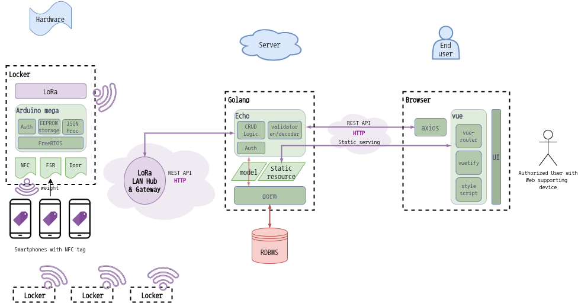

# **맡기시오** (팀 *797은거꾸로해도797*)


[**문서**](document) | [**발표자료**](PPT) | [**WEB 저장소**](https://github.com/osamhack2020/WEB_LeaveItUs_797IsPalindrome) | [**IoT 저장소**](https://github.com/osamhack2020/IoT_LeaveItUs_797IsPalindrome)

## 소개 및 설명 동영상
**맡기시오 (Leave It Us)**
는 코로나 시대에 하나의 휴대폰 보관함에 전 병력이 밀집하여 휴대폰을 불출/반납하며 생기는 접촉들을 최소화하기 위한 각 생활관별로 설치하는 휴대폰 보관함입니다. 
IoT와 Web기술을 접목하여 휴대폰에 부착된 NFC 인가 필증과 장착된 휴대폰들의 중량등을 인식한 결과를 처리하여 신뢰할 수 있는 반납 상태를 서버로 전송하기 때문에 당직계통이 일일히 인가된 유일한 휴대폰 제출 여부등을 확인하는데 발생하는 번거로움을 덜 수 있으며 웹페이지를 이용해 PC나 모바일 기기에서 원격으로 관리 가능합니다. 
일일 병력 현황과 연동하여 유연한 반납 계획 수립 및 보관함 자체에 설치된 개폐 도어를 이용한 불출/반납 시간 관리같은 여러 부가기능 또한 지원합니다.


[시연영상](https://www.youtube.com/watch?v=-X2Q5mPk3jw)

## 기능 설계


## 컴퓨터 구성 / 필수 조건 안내
### 백앤드
- [golang 빌드가 가능한 아키텍처 및 운영체제](https://github.com/golang/go/wiki/MinimumRequirements)
- golang 1.11 이상
- GNU Make 필요

### 프론트앤드
- Node 10 이상, vue-cli 4 이상, npm 필요
- 최신 2개 버전, 점유율 1% 이상, 지원 종료 되지 않은 브라우저 버전을 목표로 빌드됩니다.

### 하드웨어
- Pathname, MAC address 입력을 위한 Arduino IDE
- 이더넷 LAN

## 기술 스택
### 백앤드
- Golang + Echo
- SQL + gorm
- HMAC based Auth
- REST api
 
### 프론트앤드
- vuejs
- vuetify + vue-router(SPA)
- REST with axios 

### 하드웨어(IoT)
- Arduino mega + FreeRTOS
- LoRa
- modeling with TinkerCad
- NFC + FSR + Magnetic door sensor
- HMAC based Auth

## 설치 안내
### 프론트앤드 및 백앤드
*우분투 18 기준입니다. 다른 OS는 도커 이용을 권장합니다.*
[golang](https://golang.org/doc/install)과 npm이 설치되어있지 않다면 설치합니다.
```
#golang은 링크의 설치 방법을 따르세요.
sudo apt install npm
```
프로젝트 의존성을 설치하기 위해 아래의 명령을 프로젝트 루트 디렉터리`(WEB_LeaveItUs_797IsPalindrome/)` 에서 실행합니다.
```
sudo make install
```
프로젝트를 빌드하고 싶다면 아래와 같이 실행합니다. 루트 하위 `output/`에 프론트앤드 번들과 백앤드가 빌드됩니다.
```
make build
```
개발용으로 명령을 통해 즉시 서버를 실행하고 싶다면 아래와 같이 실행합니다.
```
sudo make serve
```
빌드 후, 서비스용으로 바이너리를 직접 실행하고 싶다면 아래와 같이 실행합니다.
```
sudo ./output/backend
```
- 백앤드 서버가 프론트앤드 서빙과 api 서버의 역할을 겸하므로 별도의 웹서버는 필요하지 않습니다.
- `make serve`의 경우 리슨 포트에 따라 sudo가 필요하지 않습니다만, 기본 설정은 80포트입니다.

## 프로젝트 사용법
- Holder는 사용할 위치에 배치하여 전원을 인가하고, Gateway는 LAN선과 연결해줍니다.
- Gateway는 MAC주소와 HTTP Request할 세부경로를 세부 설정해야 합니다.
```
IoT_LeaveItUs_797IsPalindrome/ArduinoCode/Gateway.ino 코드에
MAC 주소에 부대별 고유 MAC 주소를 설정해준다.
```
- 이후 serve 명령으로 서버를 실행하고 웹브라우저로 서버에 접속합니다.
- 자세한 내용은 시연 영상을 참고해주세요!

## 팀 정보 (Team Information)
- 김정현 (kimdictor@gmail.com), Github [Dictor](https://github.com/Dictor)
- 김상윤 (ndkim11@naver.com), Github [ndkim11](https://github.com/ndkim11)

## 저작권 및 사용권 정보
**[오픈소스 라이센스](OPENSOURCE_LICENSE.md)**


[AGPL](LICENSE)
```
Project "Leave It Us", Cellphone management system of consisted with web and iot.  
Copyright (C) 2020 JeongHyun Kim (kimdictor@gmail.com), Sangyoon Kim (ndkim11.naver.com)

This program is free software: you can redistribute it and/or modify
it under the terms of the GNU Affero General Public License as
published by the Free Software Foundation, either version 3 of the
License, or (at your option) any later version.

This program is distributed in the hope that it will be useful,
but WITHOUT ANY WARRANTY; without even the implied warranty of
MERCHANTABILITY or FITNESS FOR A PARTICULAR PURPOSE.  See the
GNU Affero General Public License for more details.

You should have received a copy of the GNU Affero General Public License
along with this program.  If not, see <http://www.gnu.org/licenses/>.
```
